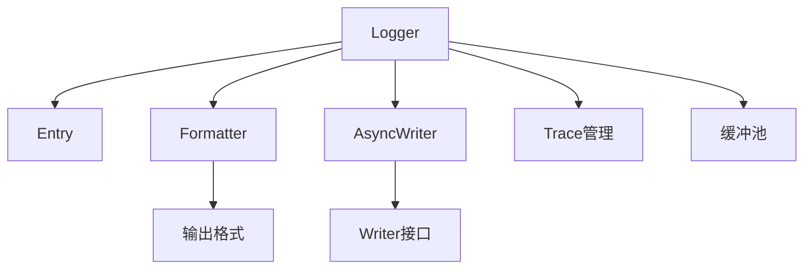

一个轻量级Go语言日志库，支持多级别日志输出和异步写入功能。

## 核心模块架构

### 模块说明
1. **Logger**（`logger.go`）
   - 核心日志控制器
   - 提供日志级别设置、前缀/后缀配置、调用栈追踪等功能
   - 支持克隆日志实例和异步写入配置

2. **Entry**（`entry.go`）
   - 日志条目结构体
   - 包含日志消息、级别、调用信息等元数据
   - 提供重置方法和结构化数据支持

3. **Formatter**（`formatter.go`）
   - 日志格式化引擎
   - 实现颜色编码、包名解析、字节缓冲池等
   - 支持克隆格式器实例

4. **AsyncWriter**（`writer_async.go`）
   - 异步写入器
   - 使用缓冲池优化性能
   - 支持多路复用写入目标

5. **Trace管理**（`trace.go`）
   - 分布式追踪支持
   - 提供GID与TraceID关联方法
   - 支持上下文追踪信息设置

6. **缓冲池**（`pool.go`）
   - 内存复用机制
   - 优化格式化操作性能
# log